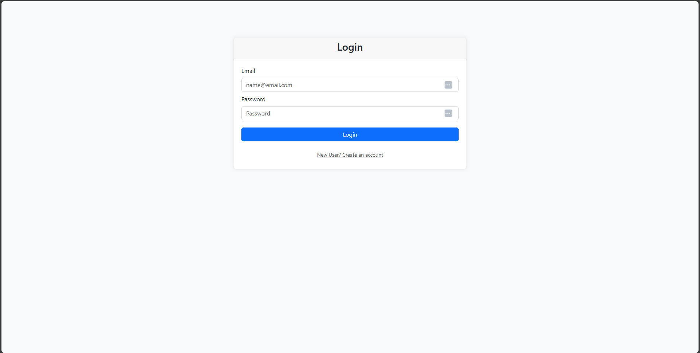
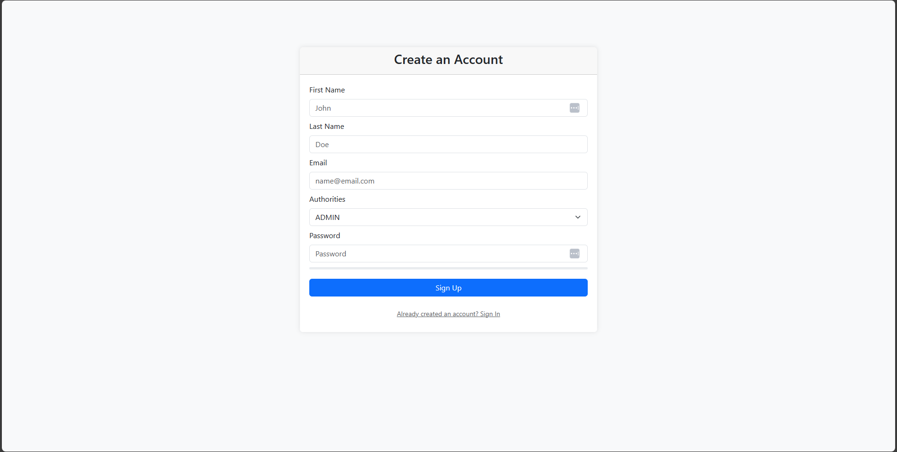
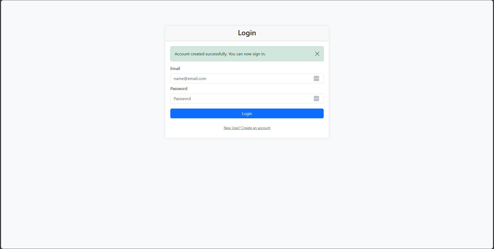

# Spring Boot 3 and Spring Security 6

This is a demo Spring Boot project showcasing how to implement basic security using Spring Security 6.

## Overview

This project demonstrates email and password authentication and role-based authorisation using Spring Boot 3 and Spring Security 6 with the new `SecurityFilterChain` and lambda expressions.
User data is stored in MySQL, and Thymeleaf is used for form-based login and registration..

## Features

### Authentication - Registration

 - Users can register with an email and password.
 - There are 2 roles: `ADMIN` and `USER`. Typically, role assignment is handled by an administrator in a production application.
 - A password strength indicator helps users evaluate the strength of their passwords.
 - Duplicate email addresses result in an error message, preventing registration.
 - Passwords are encrypted using BCrypt and stored in a MySQL database.

 ### Authentication - Login

 - After successful registration, users are redirected to the login page with a confirmation message.
 - Users can login using their email and password.
 - Incorrect email or password entries trigger an error message.
 - Successful login redirects the user to `/user`.

 ### Authorisation - Restricting Access

 - Role-based authorization restricts users from accessing specific endpoints.
 - The `/admin` endpoint, for instance, is only accessible to users with the `ADMIN` role.
 - Attempting to access restricted endpoints with insufficient role results in a 403 error.

 ## Technologies Used

 ### Frontend:

 - HTML, CSS and JavaScript (for password strength checker)
 - Thymeleaf (for server-side rendering)
 - jQuery
 - Bootstrap (for styling)

 ### Backend

 - Spring Boot 3
 - Spring Web (for building web applications)
 - Spring Security 6
 - Spring Data JPA (for persistence)
 - Spring DevTools (for hot reloading)
 - MySQL (as database)

 ## Installation

 1. **Clone the project:**

    ```bash
    git clone https://github.com/adampeer/spring-security-six.git
    cd spring-security-six
    ```

 2. **Database Configuration**

    - Install MySQL and create a database.
    - Update the `application.properties` file with your database configuration such as username, password, database name and port number.

3. **Running the Application:**

    - The application can either be run by opening it in an IDE or using the following command:
    ```bash
    ./mvnw clean package
    java -jar target/spring-security-six-0.1.jar
   ```

4. **Access the Application:**

   Open a web browser and go to `http://localhost:8080` or whatever port you've set in application.properties file.


## Usage


1. **Login using existing accounts:**

    - Two accounts are created automatically when the application starts: An `admin` account with password `password` and `ADMIN` role, and a `user` account with password `password` and with `USER` role.

    

2. **Create a User:**

   - Go to `/auth/register` and fill out the registration form, providing a first name, last name, email address, password and selecting a role.
   - The application provides a password strength indicator and an error message if the email address has already been used.
   - Click the "Sign Up" button.
   - The user will be redirected to `/auth/login` with an message saying that the account has successfully been created.
   - The user can now login with their email and password.

   

   

   

3. **Authorisation:**

   - The application defines four endpoints. 
   - There is a `/admin` endpoint that can only be accessed by users with the `ADMIN` role.
   - There is a `/user` endpoint that can only be accessed by users with either the `ADMIN` or the `USER` role.
   - The `/hello` and `/auth` endpoints are accessible to anyone without the need to log in.
   - Authorization settings can be modified in the `SecurityConfiguration` class.


4. **Logout:**

    - Users can logout can clicking "LOGOUT" or by going to the url `/auth/logout`
    - Users are then redirected to `/auth/login` with a message saying that they have successfully logged out.

    

5. **UI Design:**

   - Responsive design ensures a seamless experience on different devices.

## Key Files

- `SecurityConfiguration` - Configures Spring Security including form login, and endpoint access.

## Feedback and Support

We welcome your feedback and suggestions. If you encounter any issues or have ideas for improvements, please open an issue on our GitHub repository.

## Author

- [Adam Peer](https://github.com/adampeer)

---
